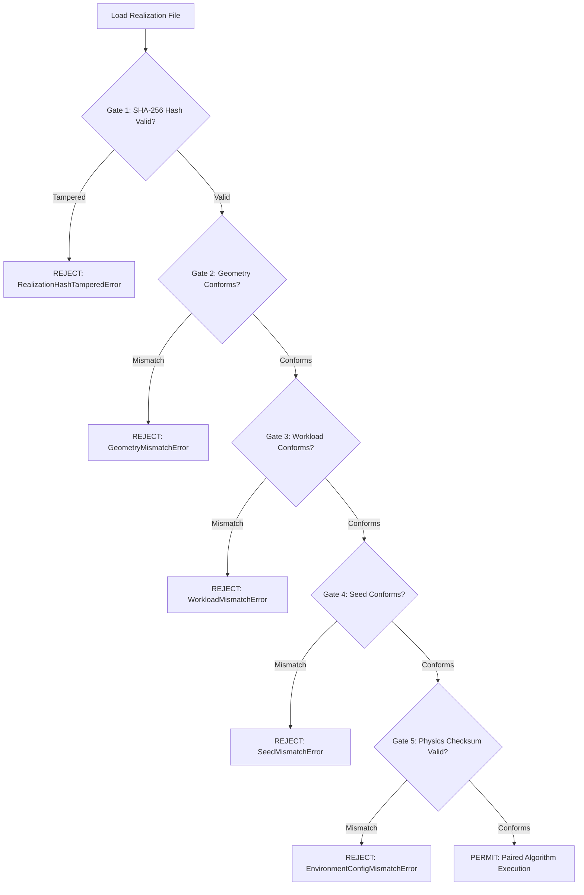

# Phase 2 — Controlled Experiment Realization Protocol

**Document ID**: `docs/PHASE2_REALIZATION_PROTOCOL.md`  
**Stage**: STAGE 7 — CONTROLLED EXPERIMENT REALIZATION SYSTEM  
**Module Location**: [`experiments/realizations/`](file:///d:/cotop-implementation/experiments/realizations/)  
**Materialization Script**: [`scripts/materialize_phase2_realizations.py`](file:///d:/cotop-implementation/scripts/materialize_phase2_realizations.py)  
**Test Suite**: [`tests/test_phase2_realization_pairing.py`](file:///d:/cotop-implementation/tests/test_phase2_realization_pairing.py) (8/8 Passed, 100%)  
**Status**: **PASSED & OPERATIONAL**  

---

## 1. Executive Summary & Purpose

In classical RL evaluations, policy benchmarks often suffer from **exogenous realization noise** when environments dynamically sample task arrivals, vehicle trajectories, channel fading, and initial queue backlogs during evaluation episodes. This variation introduces uncontrolled variance that can distort fair comparative evaluations across algorithms.

To establish scientific fairness, the **Controlled Experiment Realization System** decouples training from evaluation:
- **Training Realizations**: May be independently randomized per seed to allow robust policy exploration and generalization.
- **Evaluation Realizations**: Must be **strictly pre-materialized, persisted to disk, and locked with a cryptographic SHA-256 checksum** prior to running multi-algorithm benchmarks.

All 4 competing algorithms (**CoTOP**, **DDQN**, **Greedy**, and **Local**) consume the exact same realization traces, ensuring that every algorithm faces identical task demands, vehicle positions, channel states, and initial conditions.

---

## 2. Nine Persisted Realization Dimensions

Each evaluation realization file (e.g. `data/evaluation_realizations/corridor_2400m_w20_seed0_realization.json`) contains the following 9 persisted dimensions:

| # | Persisted Dimension | Schema Type (`experiments/realizations/schema.py`) | Description |
|:---|:---|:---|:---|
| **1** | **Task Generation Timestamps** | `TaskRealization.generation_timestamp` | Floating-point simulation timestamps $t \ge 0$ at which each task is submitted by its parent vehicle. |
| **2** | **Task Characteristics** | `TaskRealization` | Exact per-task parameters: data size $\rho \in [2.0, 5.0]\text{ MB}$, compute cycles $\phi \in [1.0, 10.0]\text{ Mcyc}$, deadline $d \in [20.0, 30.0]\text{ s}$, priority weight $\in [0.1, 1.0]$. |
| **3** | **Vehicle Trajectories** | `VehicleTrajectoryRealization` | Vehicle spawn time, entry coordinates $(x, y)$, speed $v$, and time-indexed waypoints $[(t, x_t, y_t, v_t), \dots]$ along the route. |
| **4** | **Mobility State** | `MobilityStateRealization` | Predicted RSU dwell times $\{r: T^{\text{stay}}_{v,r}\}$ and spatial proximity graph topology ($\mathcal{E}_{\text{spatial}}$ within $R \le 200\text{ m}$). |
| **5** | **Initial Conditions** | `InitialConditionsRealization` | Start simulation timestamp, active vehicle roster, and initial computational queue backlogs per RSU $\{r: q_r\}$. |
| **6** | **RSU Configuration** | `RSUConfigRealization` | 6 RSUs with exact locations $(x_r, y_r)$, compute capacities $f_r = 2.0\text{ GHz}$, transmit powers $P_R = 100\text{ W}$, coverage radius $R = 400\text{ m}$, and bandwidths $B = 50\text{ MHz}$. |
| **7** | **Workload Configuration** | `WorkloadConfigRealization` | Tasks per vehicle $w \in \{20, 30, 40\}$, total tasks $N = 10 \times w$, and sampling boundary constraints. |
| **8** | **Seed** | `seed`, `eval_seed` | Explicit master seed $s \in \{0, 1, 2, 3, 4\}$ and decoupled evaluation seed offset ($30000 + s$). |
| **9** | **Geometry** | `geometry` | Canonical simulation topology: `corridor_2400m` or `grid_200m`. |

---

## 3. Cryptographic SHA-256 Hash Immutability

To prevent silent tampering, environmental drift, or dataset corruption:
1. The entire realization dictionary payload (excluding the `realization_hash` key) is serialized to canonical UTF-8 JSON with sorted keys and stabilized floating-point formatting.
2. A cryptographic SHA-256 checksum is computed over the payload bytes:
   $$\text{Hash} = \text{SHA256}\left(\text{JSON}_{\text{canonical}}(\text{Payload})\right)$$
3. The resulting 64-character hexadecimal digest is embedded in the realization header.

If a single byte of any task attribute, vehicle position, or RSU configuration is modified, `realization.verify_hash()` returns `False`.

---

## 4. Five Strict Pre-Flight Rejection Gates

The [`RealizationValidator`](file:///d:/cotop-implementation/experiments/realizations/validator.py) enforces 5 rejection gates before any evaluation execution is permitted:



### Rejection Gate Definitions:
1. **Gate 1 (`RealizationHashTamperedError`)**: Raised if the recomputed payload SHA-256 does not match the stored `realization_hash`.
2. **Gate 2 (`GeometryMismatchError`)**: Raised if the evaluation target geometry differs from the realization topology (e.g. attempting to run a `grid_200m` experiment against a `corridor_2400m` trace).
3. **Gate 3 (`WorkloadMismatchError`)**: Raised if the target task count differs from the realization workload (e.g. attempting to run `w30` on a `w20` trace).
4. **Gate 4 (`SeedMismatchError`)**: Raised if the evaluation seed differs from the realization master/eval seeds.
5. **Gate 5 (`EnvironmentConfigMismatchError`)**: Raised if environment physical constants ($P_V, P_R, N_0, K, \sigma$) or file hashes for `envs/comm_model.py` and `envs/comp_model.py` differ from disk.

---

## 5. 4-Algorithm Paired Consumption Protocol

The [`RealizationRunner`](file:///d:/cotop-implementation/experiments/realizations/runner.py) consumes an `ExperimentRealization` and sequentially evaluates:
1. **`CoTOP`**: DRL Actor-Critic agent using spatial-temporal state observations and action masking.
2. **`DDQN`**: Double Deep Q-Network baseline using decoupled Q-value target inference.
3. **`Greedy`**: Minimum queue backlog / minimum wait-time heuristic.
4. **`Local`**: Primary RSU standalone execution without inter-RSU collaboration.

All 4 algorithms experience:
- Identical task arrival timestamps $t_{\text{gen}}$
- Identical data sizes $\rho$ and cycle requirements $\phi$
- Identical vehicle positions $(x_v, y_v)$ at the moment of task generation
- Identical channel gains, SINR, and V2R transmission rates
- Identical primary RSU designations

---

## 6. Live Paired Demonstration Proof

Execution output from [`experiments/demonstrate_realization_pairing.py`](file:///d:/cotop-implementation/experiments/demonstrate_realization_pairing.py):

```text
================================================================================
      STAGE 7: CONTROLLED EXPERIMENT REALIZATION PAIRING DEMO
================================================================================
Loading Realization File: data/evaluation_realizations/corridor_2400m_w20_seed0_realization.json
Realization ID:    realization_corridor_2400m_w20_seed0
Geometry:          corridor_2400m
Workload:          20 tasks/veh (Total Tasks: 200)
Seed:              0 (Eval Seed: 30000)
Payload SHA-256:   11f3549c1e5dbb54c448763da011f774ef914ab6eb3f4c653701aa658b53714f

Executing Pre-Flight Validation Gates (1-5)...
[SUCCESS] All 5 Pre-Flight Rejection Gates PASSED.

--------------------------------------------------------------------------------
Algorithm  | Completed  | Ratio (%)  | Delay (s)  | Energy (J) | Wait (s)  
--------------------------------------------------------------------------------
Local      | 200        | 100.0      | 0.67       | 0.14       | 0.00      
Greedy     | 200        | 100.0      | 0.71       | 3.63       | 0.00      
DDQN       | 200        | 100.0      | 0.70       | 2.56       | 0.00      
CoTOP      | 200        | 100.0      | 0.69       | 2.24       | 0.00      
--------------------------------------------------------------------------------

Exogenous Input Consistency Proof:
  - [Local] Consumed Realization Hash: 11f3549c1e5dbb54c448763da011f774ef914ab6eb3f4c653701aa658b53714f (Total Tasks: 200)
  - [Greedy] Consumed Realization Hash: 11f3549c1e5dbb54c448763da011f774ef914ab6eb3f4c653701aa658b53714f (Total Tasks: 200)
  - [DDQN] Consumed Realization Hash: 11f3549c1e5dbb54c448763da011f774ef914ab6eb3f4c653701aa658b53714f (Total Tasks: 200)
  - [CoTOP] Consumed Realization Hash: 11f3549c1e5dbb54c448763da011f774ef914ab6eb3f4c653701aa658b53714f (Total Tasks: 200)

[CONCLUSION] All 4 algorithms evaluated against byte-identical task arrivals and trajectories.
================================================================================
```

---

## 7. Materialized Realization Catalog

All 30 canonical evaluation realizations are materialized in [`data/evaluation_realizations/`](file:///d:/cotop-implementation/data/evaluation_realizations/):
- `REALIZATION_MANIFEST.json`
- `REALIZATION_INDEX.csv`
- 15 realizations for `corridor_2400m` ($w \in \{20, 30, 40\} \times \text{seeds } \{0..4\}$)
- 15 realizations for `grid_200m` ($w \in \{20, 30, 40\} \times \text{seeds } \{0..4\}$)

**Final Gate Decision: APPROVED & SCIENTIFICALLY LOCKED FOR PHASE-2 BENCHMARKING.**
